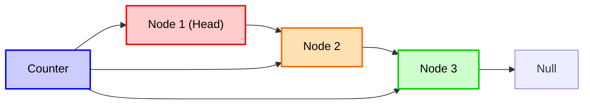
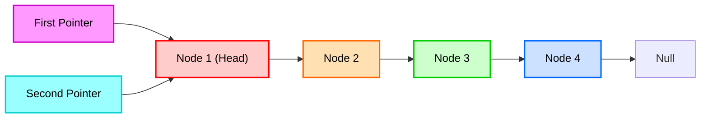
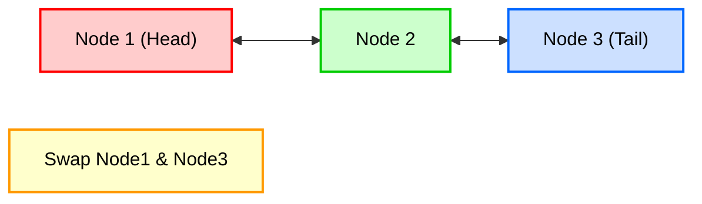
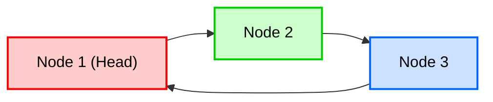

# 🧩 Activities — Linked Lists (Solutions & Explanations)

Welcome! This document explains the four lab activities from **Linked Lists (SLL, DLL, CLL)** and shows how each solution was implemented. Each activity includes the problem statement, the chosen approaches, complexity notes, key edge-cases, and visual diagrams to help students understand pointer manipulations.

---

## 🔢 Activity 01 — Count Nodes in SLL

**Problem:** Count the number of nodes in a singly linked list.

**Solutions provided:**
1. **Traversal-based count** (`countNodes()`): iterate from `head` to `null`, incrementing a counter.
   - Time: **O(n)**, Space: **O(1)**.
   - Good when you don't maintain metadata.

2. **Maintained size attribute** (`size` field):
   - Update `size++` on insertions and `size--` on deletions.
   - Query with `size()` in **O(1)**.
   - Requires careful updates on every mutation (edge-case: deletion when element not found — do **not** decrement).

**Key tests:**
- Empty list → count = 0.
- Single node list → count = 1.
- After several insertions and deletions validate `size()` matches `countNodes()`.

**Diagram — Traversal Count:**



---

## 🔁 Activity 02 — Print Nth Node from End in SLL

**Problem:** Print/fetch the `k`-th node from the end.

**Solutions provided:**
1. **Use size**: compute index from head `idx = size - k`, traverse to that index.
   - Time: **O(n)**, Space: **O(1)**.
   - Requires `size` to be maintained.

2. **Two-pointer technique** (`nthNodeFromEnd`):
   - Advance `first` pointer `k` steps, then move `first` and `second` together until `first` is null.
   - `second` is the answer.
   - Single pass: Time **O(n)**, Space **O(1)**.
   - Edge-cases: `k <= 0`, `k > size` — return `null` or indicate invalid input.

**Why two-pointer is preferred in interviews:** single-pass, no need for extra metadata.

**Diagram — Two-Pointer Technique:**



---

## 🔀 Activity 03 — Swap Two Nodes in DLL

**Problem:** Swap two nodes (positions) in a doubly linked list by changing pointers (not by swapping element data).

**Approach used:**
- Rewire `prev` and `next` of the two nodes and their adjacent nodes.
- Update `head`/`tail` if either node is at the boundary.
- Handle `x == y` and `null` arguments.

**Complexity:** O(1) pointer updates (after finding nodes), O(n) to locate nodes if you search by value first.

**Corner cases to test:**
- Swap head with tail.
- Swap adjacent nodes.
- Swap when one node is null (no-op).
- Swap equal nodes (no-op).

**Diagram — Swap in DLL:** 



---

## 🔄 Activity 04 — Circular Linked List (CLL) — Basic operations

**Problem:** Implement a single-direction circular linked list with:
- `insertAtHead`, `insertAtTail`, `deleteByValue`, and `traverse`.

**Important behaviours & edge-cases:**
- Empty-list insertion must make `node.next = node`.
- Single-node deletion must set head to `null`.
- Deleting head can be done by copying `head.next`'s data into `head` and unlinking the next node — this avoids scanning for the tail to update.
- Traversal must check for empty list to avoid runtime errors.

**Complexity:** All operations are O(n) in the current implementation because we do not maintain a `tail` pointer. If you add `tail`, insert-at-tail becomes O(1).

**Diagram — CLL Traversal:**



---

## ▶ How to run each activity file

Files are located under `src/activities/`:

```bash
# from repository root
javac -d out src/activities/*.java
java -cp out linkedlist.activities.SLL
java -cp out linkedlist.activities.DLL
java -cp out linkedlist.activities.CLL
```

> Or open the files in your IDE (NetBeans/IntelliJ/VS Code) and run individual main() methods to observe behavior.

---

## 📺 Solutions video

A recorded walkthrough that explains the reasoning and trace execution step-by-step (linked from the main README).

**Video: [Activity Solutions – Linked Lists Lecture](https://youtu.be/w_HARbHwGZk)**

---

## ✅ Quick checklist for instructors / TAs

- Add unit tests for empty, single-node, multiple-node lists.
- Verify `size` field matches `countNodes()` after random operations.
- Test `nth` functions for k = 1, k = size, k > size, k <= 0.
- Demonstrate DLL swap on adjacent and non-adjacent nodes.

---

## 📌 Notes for students

- Read the inline comments in each class — they explain what each block does.
- Try to reason through pointer updates on paper before coding.
- When debugging, print the list after every operation to visualize pointer changes.

**Happy learning! 🎓✨**
